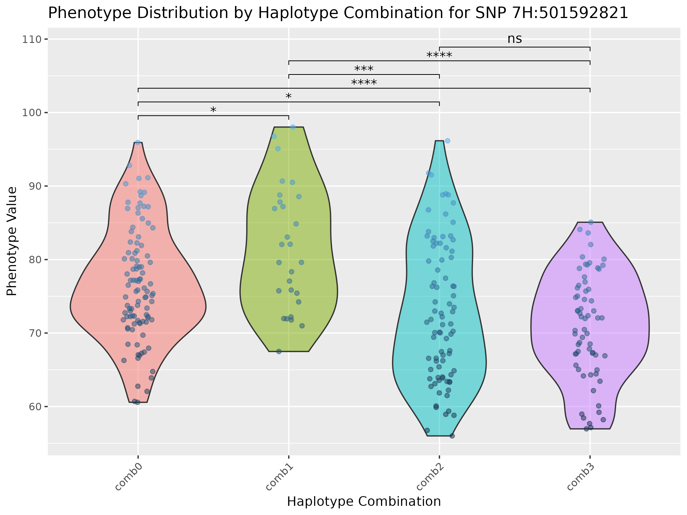

# Haplotype Analysis Project

This project performs haplotype analysis and visualizes phenotypic data across multiple genetic/haplotype combinations to understand the association between haplotypes (SNPs linked by LD) and variation in traits.

## Dependencies

Please install the following R packages before installing the `HaploTraitR` package:

```r
# Install required packages if not already installed
install.packages(c("devtools", "Rcpp", "igraph", "ggplot2", "rstatix", "dplyr", "ggpubr", "reshape2", "gridExtra", "ggtext"))
```

## Installation

```r
# Install the HaploTraitR package from GitHub
devtools::install_github("AlsammanAlsamman/HaploTraitR")
```

## Sample Files

- **Haplotype File:** `Barley_50K_KNNimp.hmp.txt` - Contains SNP genotype information.
- **GWAS File:** `SignificantSNP_GWAS.csv` - Contains significant SNPs identified from a GWAS study.
- **Phenotype File:** `Pheno_ANN19.tsv` - Contains phenotypic data for the traits of interest.

## Test Parameters

- **Distance Threshold:** 1,000,000 (for clustering all SNPs within 1Mb of the significant SNPs)
- **Cluster Count Threshold:** 5 (minimum number of SNPs in a cluster)
- **LD Threshold:** 0.3 (minimum LD value to consider two SNPs in LD)
- **Combination Frequency Threshold:** 0.1 (minimum genotypes with the same combination to consider the combination)

## Configuration Settings

The `HaploTraitR` package allows users to customize various configuration settings. Below are the default settings that can be changed by the user:

- **outfolder:** `NULL` (Output folder for results)
- **dist_threshold:** `1000000` (Distance threshold for clustering SNPs within 1Mb)
- **dist_cluster_count:** `5` (Minimum number of SNPs in a cluster)
- **ld_threshold:** `0.3` (Minimum LD value to consider two SNPs in LD)
- **comb_freq_threshold:** `0.1` (Minimum frequency of genotypes with the same combination)
- **fdr_threshold:** `0.05` (False discovery rate threshold for multiple testing correction)
- **fdr_method:** `"fdr"` (Method for FDR correction)
- **t_test_threshold:** `0.05` (Threshold for t-test significance)
- **t_test_method:** `"t.test"` (Method for t-test)
- **rsid_col:** `"rsid"` (Column name for rsid in GWAS file)
- **pos_col:** `"pos"` (Column name for position in GWAS file)
- **chr_col:** `"chr"` (Column name for chromosome in GWAS file)
- **pval_col:** `"p"` (Column name for p-value in GWAS file)
- **fdr_col:** `"fdr"` (Column name for FDR in GWAS file)
- **phenotypename:** `"Phenotype"` (Name of the phenotype)
- **phenotypeunit:** `NULL` (Unit of the phenotype)

To initialize the default configuration, use the `initialize_config` function:

```r
initialize_config()
```

To set or get specific configuration values, use the `set_config` and `get_config` functions:

```r
# Set a configuration value
set_config(config = list(dist_threshold = 500000))

# Get a configuration value
dist_threshold <- get_config("dist_threshold")
print(dist_threshold)
```

## Usage

### Example Workflow

```r
library(HaploTraitR)

# Step 1: Create a unique output folder for results
result_folder <- create_unique_result_folder(location = "sampleout")
set_config(config = list(outfolder = result_folder))

# Step 2: Read Data Files
gwasfile <- "sampledata/SignificantSNP_GWAS.tsv"
hapfile <- "sampledata/Barley_50K_KNNimp.hmp.txt"
phenofile <- "sampledata/Pheno_ANN19.tsv"

gwas <- readGWAS(gwasfile, sep = "\t")
hapmap <- readHapmap(hapfile)
pheno <- read.csv(phenofile, header = TRUE, sep = "\t")

# Step 3: Set phenotype information in the configuration
set_config(config = list(phenotypename = "PH", phenotypeunit = "cm"))

# Step 4: Generate Boxplots for Genotype-Phenotype Distribution
bxplts <- boxplot_genotype_phenotype(pheno, gwas, hapmap)

# Step 5: Cluster SNPs by Chromosome
dist_clusters <- getDistClusters(gwas, hapmap)

# Step 6: Compute LD Matrices
LDsInfo <- computeLDclusters(hapmap, dist_clusters)

# Step 7: Cluster LD Values and Convert to Haplotypes
clusterLDs <- getLDclusters(LDsInfo)
haplotypes <- HaploTraitR::convertLDclusters2Haps(hapmap, clusterLDs)

# Step 8: Get Sample Haplotypes and Save
snpcombsample <- HaploTraitR::getHapCombSamples(haplotypes, hapmap)

# Step 9: Generate SNP Combination Tables
SNPcombTables <- getSNPcombTables(snpcombsample, pheno)

# Step 10: Perform t-tests on SNP Combinations
t_test_snpComp <- HaploTraitR::testSNPcombs(SNPcombTables)

# Step 11: Generate and Save Haplotype Combination Boxplots
generateHapCombBoxPlots(SNPcombTables, t_test_snpComp)

# Step 12: Plot Haplotype Distribution
lDplots <- plotLDForClusters(clusterLDs)

# Step 13: Plot LD Combination Matrix with LD
LDCombs <- plotLDCombMatrix(clusterLDs, haplotypes, gwas)
```

## Example Output

Here are some example plots generated using the `HaploTraitR` package:

### Haplotype Combination Boxplot


### LD Combination Matrix


## Conclusion

This README provides an overview of the steps involved in performing haplotype analysis using the `HaploTraitR` package. For more detailed instructions, please refer to the `tutorial.Rmd` file included in the repository. This project aims to help researchers understand the genetic basis of phenotypic variation by analyzing and visualizing the associations between haplotypes and traits.
