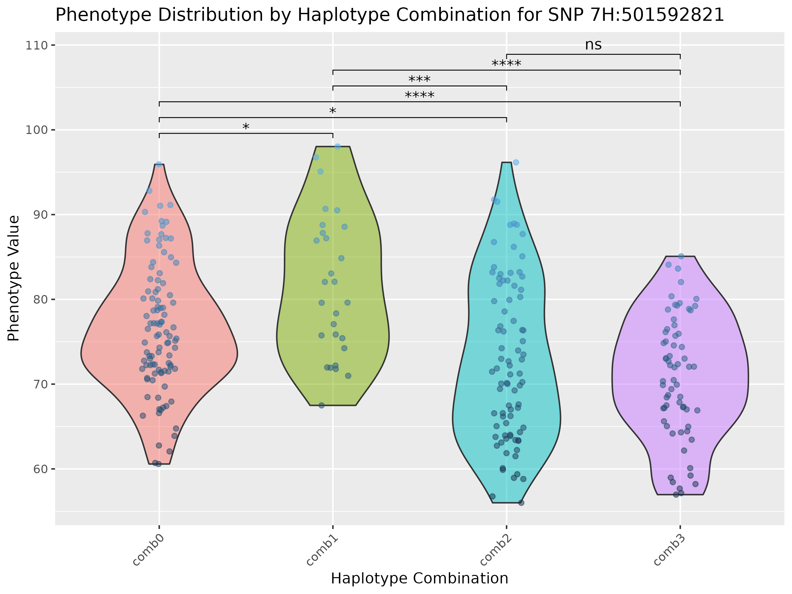

# Haplotype Analysis Project

This project performs haplotype analysis and analyzing and visualizing phenotypic data across multiple genetic / haplotypes combinations 
to understand the assocaition between haplotype (SNPs linked by LD) and variation in traits. 

## Dependencies
please install the following packages before installing the HaploTraitR package:

```r
# if not installed
install.packages(c("devtools","Rcpp", "igraph", "ggplot2", "rstatix", "dplyr", "ggpubr", "reshape2", "gridExtra","ggtext"))


# install the required packages
if (!requireNamespace("BiocManager", quietly = TRUE))
    install.packages("BiocManager")
BiocManager::install("GWASTools")
BiocManager::install("biomaRt")
BiocManager::install("snplinkage")
install.packages("snplinkage")
```

## instalation
```r
devtools::install_github("AlsammanAlsamman/HaploTraitR")
```

## Sample Files

- **Haplotype File:** `Barley_50K_KNNimp.hmp.txt`
- **GWAS File:** `SignificantSNP_GWAS.csv`
- **Phenotype File:** `Pheno_ANN19.tsv`


## test Parameters

- **Distance Threshold:** 1,000,000 (for clustering all SNPs within 1Mb of the significant SNPs)
- **Cluster Count Threshold:** 5 (minimum number of SNPs in a cluster)
- **LD Threshold:** 0.3 (minimum LD value to consider two SNPs in LD)
- **Combination Frequency Threshold:** 0.1 (minimum genotypes with the same combination to consider the combination)

## Installation

```r
# Install the HaploTraitR package from github
devtools::install_github("AlsammanAlsamman/HaploTraitR")
```

## Usage

Please use the tutorial provided in the `tutorial.Rmd` file for detailed instructions on using the `HaploTraitR` package.

# Example


