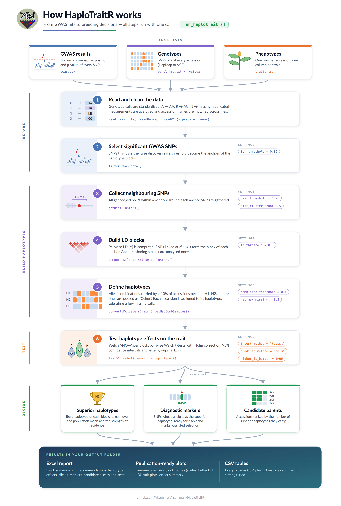
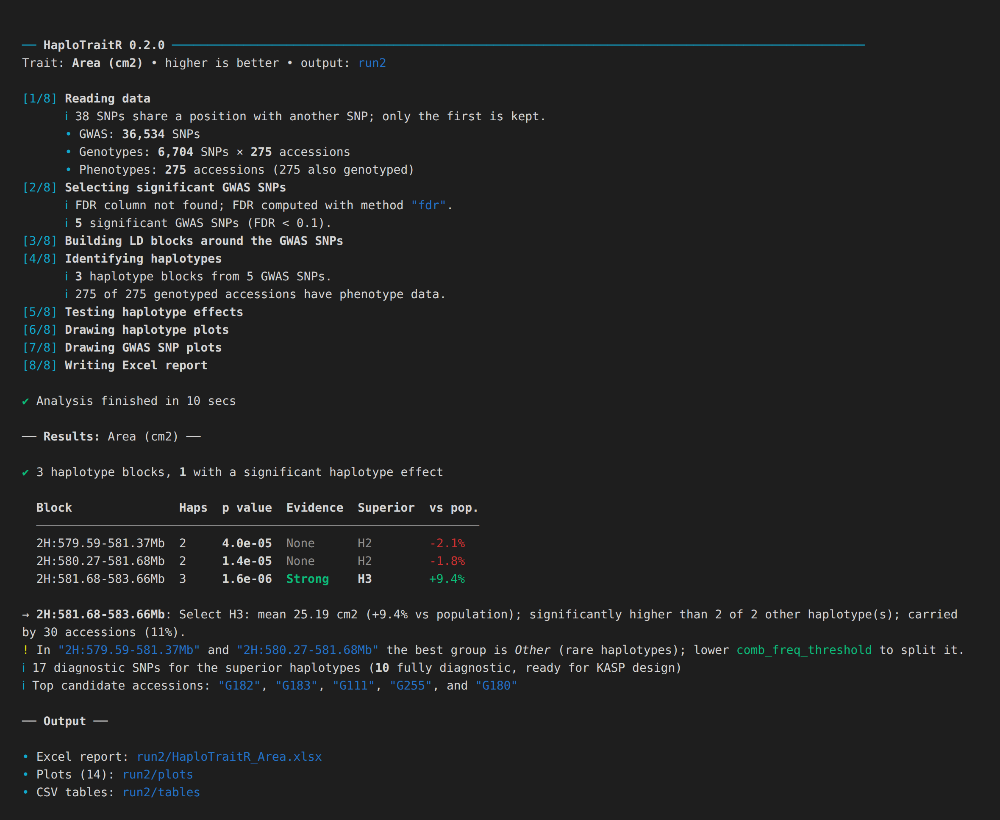
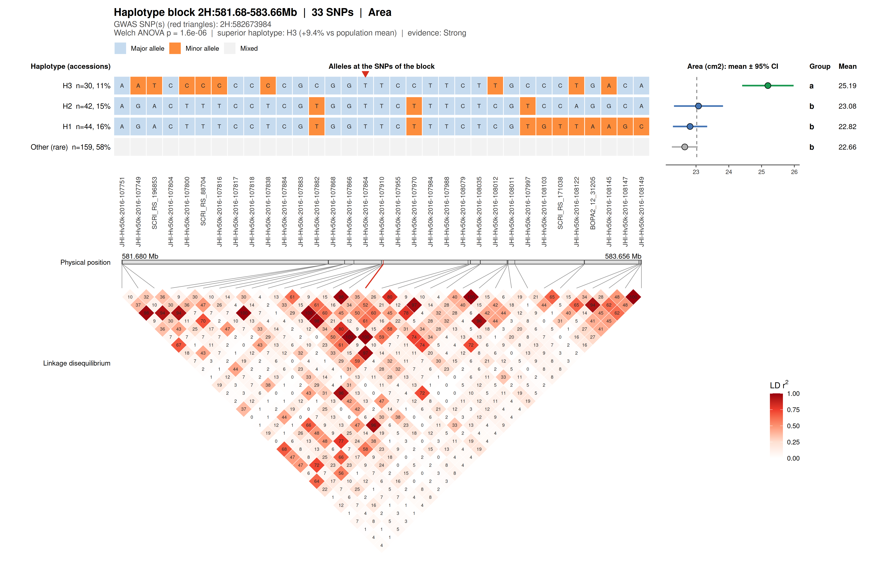
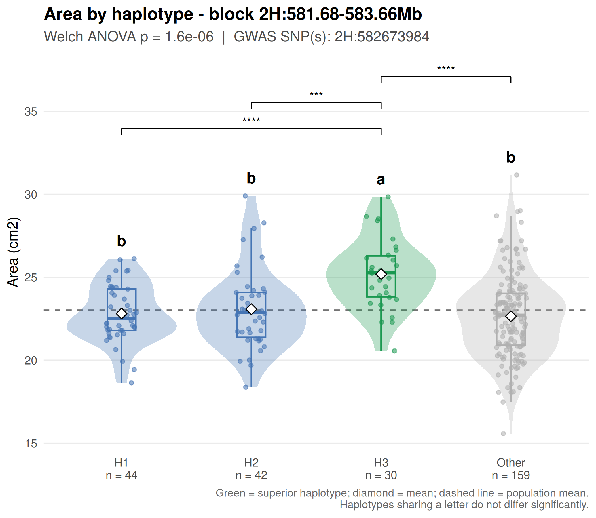
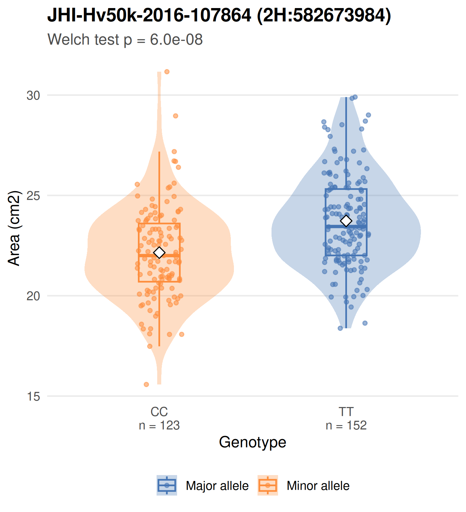
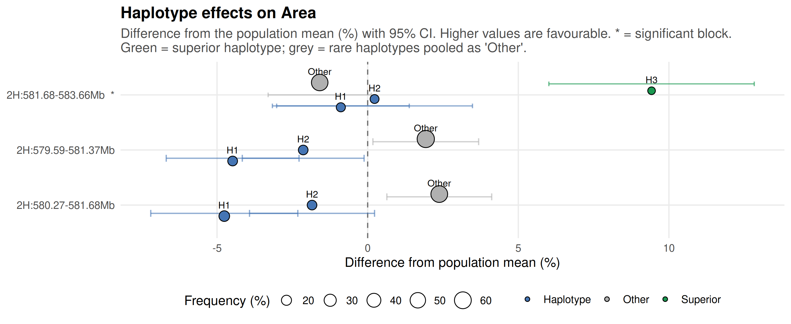
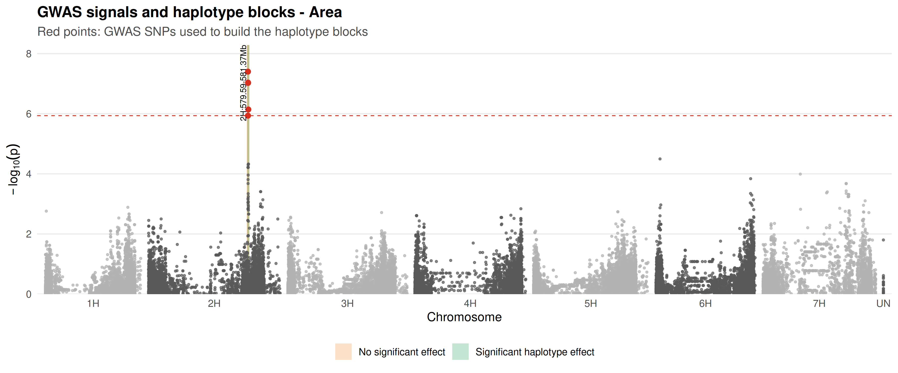

<p align="center">
  
</p>

<h1 align="center">HaploTraitR</h1>

<p align="center">
  <b>From GWAS hits to breeding decisions.</b><br/>
  Haplotype-based trait analysis for plant breeders, in one R function call.
</p>

<p align="center">
  
  
  
  
  
  
</p>

<p align="center">
  <a href="#-how-it-works">How it works</a> •
  <a href="#-installation">Installation</a> •
  <a href="#-quick-start">Quick start</a> •
  <a href="#-what-you-get">What you get</a> •
  <a href="#-how-to-read-the-results">Reading the results</a> •
  <a href="#-team">Team</a>
</p>

---

## ✨ Why HaploTraitR?

GWAS points to single SNPs. Breeders select on **haplotypes**, the combinations of alleles inherited together. HaploTraitR bridges the two and answers the questions a breeder asks next:

<table>
  <tr>
    <td width="50%" valign="top">
      <h3>🧬 Which haplotypes?</h3>
      Builds <b>haplotype blocks</b> (SNPs in linkage disequilibrium) around every significant GWAS SNP and identifies the haplotypes H1, H2, … carried by your accessions.
    </td>
    <td width="50%" valign="top">
      <h3>🏆 Which one is better?</h3>
      Tests each haplotype's effect on the trait, gives letter groups and 95% confidence intervals, and names the <b>superior haplotype</b> with a plain-language recommendation.
    </td>
  </tr>
  <tr>
    <td width="50%" valign="top">
      <h3>🎯 How do I select it?</h3>
      Lists the <b>diagnostic SNPs</b> that tag the superior haplotype. These are ready-made candidates for KASP assays and marker-assisted selection.
    </td>
    <td width="50%" valign="top">
      <h3>🌱 Which lines do I cross?</h3>
      Ranks <b>candidate parents</b> by the number of superior haplotypes they carry, including genotyped lines that were never phenotyped.
    </td>
  </tr>
</table>

## 🔎 How it works

<p align="center">
  
</p>

## 📦 Installation

```r
install.packages("remotes")
remotes::install_github("AlsammanAlsamman/HaploTraitR")
```

> [!TIP]
> HaploTraitR uses only **ggplot2**, **openxlsx** and **cli** (which comes with ggplot2). It has no compiled code, so it installs on Windows, macOS and Linux without Rtools or a compiler.

## 🚀 Quick start

```r
library(HaploTraitR)

results <- run_haplotraitr(
  gwas      = "my_gwas_results.csv",   # marker, chromosome, position, p-value
  genotypes = "my_genotypes.hmp.txt",  # HapMap (.hmp.txt) or VCF (.vcf / .vcf.gz)
  pheno     = "my_phenotypes.tsv",     # first column = accession, then one column per trait
  trait     = "Yield",
  unit      = "t/ha",
  outfolder = "results_yield",
  higher_is_better = TRUE              # FALSE for e.g. disease scores or days to heading
)
```

**Try it now** with the barley example data that ships with the package:

```r
ex <- function(f) system.file("extdata", f, package = "HaploTraitR")

results <- run_haplotraitr(
  gwas = ex("gwas_area_ann19.csv.gz"), genotypes = ex("Barley_50K.tsv.gz"),
  pheno = ex("area_ann19.tsv"), trait = "Area", unit = "cm2",
  outfolder = "barley_example", config = list(fdr_threshold = 0.1)
)
```

The console guides you through every step and ends with a colour-coded summary:

<p align="center">
  
</p>

<details>
<summary><b>My GWAS file uses other column names</b></summary>

<br/>

Tell HaploTraitR which columns to use:

```r
run_haplotraitr(..., config = list(rsid_col = "Marker", chr_col = "Chr",
                                   pos_col = "Pos", pval_col = "P.value"))
```
</details>

<details>
<summary><b>I have several traits</b></summary>

<br/>

Call `run_haplotraitr()` once per trait, each with its own GWAS file and output folder:

```r
for (trait in c("Yield", "Height", "Heading")) {
  run_haplotraitr(gwas = paste0("gwas_", trait, ".csv"), genotypes = "panel.hmp.txt",
                  pheno = "traits.tsv", trait = trait, outfolder = paste0("results_", trait),
                  higher_is_better = trait != "Heading")
}
```
</details>

## 📊 What you get

Everything is written to your output folder. **Start with the Excel report.**

| | Output | What it shows |
|:-:|---|---|
| 📗 | `HaploTraitR_<trait>.xlsx` | Formatted report with superior haplotypes highlighted, see the sheets below |
| 🗺️ | `plots/genome_overview` | Manhattan plot with the haplotype blocks highlighted |
| 📈 | `plots/haplotype_effects_summary` | Effect of every haplotype in every block (% vs population mean) |
| 🌱 | `plots/candidate_accessions` | Top accessions and the superior haplotypes they carry |
| 🧬 | `plots/haplotype_blocks/` | Per block: haplotype alleles, trait mean ± 95% CI and the LD heat map |
| 🎻 | `plots/haplotype_trait_plots/` | Per block: trait distribution of each haplotype with letter groups |
| 🔬 | `plots/gwas_snp_plots/` | Per GWAS SNP: trait distribution of each genotype |
| 🗂️ | `tables/`, `LD_matrices/`, `parameters.txt` | CSV copies of all tables, LD matrices and the settings used |

<details open>
<summary><b>Excel report sheets</b></summary>

<br/>

| Sheet | Content |
|---|---|
| **Read me** | What each sheet contains and how to interpret it |
| **Block summary** | One row per block: superior haplotype, effect, evidence and a **recommendation** |
| **Haplotype effects** | Accessions, frequency, mean, 95% CI, difference vs population and **letter groups** |
| **Haplotype alleles** | The allele of each haplotype at each SNP |
| **Diagnostic markers** | SNPs that tag the superior haplotype; *fully diagnostic* ones are KASP candidates |
| **Candidate accessions** | The haplotype every accession carries, ranked by superior haplotypes carried |
| **Pairwise tests** · **GWAS SNPs** · **Parameters** | Full statistics, the GWAS SNPs used and the settings |
</details>

### Gallery

<table>
  <tr>
    <td colspan="2" align="center">
      <br/>
      <sub><b>Haplotype block.</b> Alleles of each haplotype (top), trait mean ± 95% CI with letter groups (right) and LD between the SNPs (bottom). Red triangles mark the GWAS SNP.</sub>
    </td>
  </tr>
  <tr>
    <td width="58%" align="center">
      <br/>
      <sub><b>Trait by haplotype.</b> The superior haplotype is shown in green; letters give significance groups.</sub>
    </td>
    <td width="42%" align="center">
      <br/>
      <sub><b>GWAS SNP.</b> Trait distribution of each genotype at a significant SNP.</sub>
    </td>
  </tr>
  <tr>
    <td colspan="2" align="center">
      <br/>
      <sub><b>Effects across blocks.</b> Difference of every haplotype from the population mean (%), with 95% CI.</sub>
    </td>
  </tr>
  <tr>
    <td colspan="2" align="center">
      <br/>
      <sub><b>Genome overview.</b> GWAS signals with the haplotype blocks highlighted.</sub>
    </td>
  </tr>
</table>

## 📖 How to read the results

| Term | Meaning |
|---|---|
| **H1, H2, …** | Allele combinations carried by at least `comb_freq_threshold` (10%) of the accessions; H1 is the most frequent |
| **Other** | Rare combinations, plus accessions with too many missing calls |
| **Letter groups** | Haplotypes sharing a letter do not differ significantly; **a** is the best group |
| **Evidence: Strong** | The superior haplotype is significantly better than *every* other haplotype |
| **Evidence: Moderate** | It is significantly better than *some* of the others |
| **Evidence: None** | No significant difference: low priority for selection |

> [!NOTE]
> If **Other** is the best group, the favourable variant is a rare haplotype. Lower `comb_freq_threshold` (for example `0.05`) to separate it.

## ⚙️ Settings

<details>
<summary><b>All settings</b> (see them in R with <code>list_config()</code>)</summary>

<br/>

Change settings with `set_config()` or with the `config` argument of `run_haplotraitr()`.

| Parameter | Default | Meaning |
|---|---|---|
| `fdr_threshold` | 0.05 | FDR threshold used to select significant GWAS SNPs |
| `dist_threshold` | 1000000 | Window (bp) around each GWAS SNP |
| `dist_cluster_count` | 5 | Minimum number of SNPs in a window / block |
| `ld_threshold` | 0.3 | Minimum LD (r²) to link SNPs into a block |
| `comb_freq_threshold` | 0.1 | Minimum frequency of a haplotype |
| `hap_max_missing` | 0.2 | Maximum fraction of missing calls when assigning an accession to a haplotype |
| `t_test_method` | `"t.test"` | `"t.test"` (Welch) or `"wilcox.test"` |
| `p_adjust_method` | `"holm"` | Correction for pairwise haplotype tests |
| `t_test_threshold` | 0.05 | Significance level |
| `higher_is_better` | `TRUE` | Direction of the favourable trait value |
| `plot_format` / `plot_dpi` | `"png"` / 300 | Plot file format and resolution |
</details>

<details>
<summary><b>Step-by-step workflow</b> (for advanced users)</summary>

<br/>

Every step of `run_haplotraitr()` is available on its own:

```r
library(HaploTraitR)
set_config(list(phenotypename = "Area", phenotypeunit = "cm2", fdr_threshold = 0.1,
                outfolder = create_unique_result_folder(location = "sampleout")))
ex <- function(f) system.file("extdata", f, package = "HaploTraitR")

gwas      <- read_gwas_file(ex("gwas_area_ann19.csv.gz"))
hapmap    <- readHapmap(ex("Barley_50K.tsv.gz"))            # or readVCF("file.vcf.gz")
pheno     <- read.delim(ex("area_ann19.tsv"))

gwas_sig  <- filter_gwas_data(gwas)                          # significant GWAS SNPs
windows   <- getDistClusters(gwas_sig, hapmap)               # SNPs near each GWAS SNP
LDsInfo   <- computeLDclusters(hapmap, windows)              # LD (r2) matrices
blocks    <- getLDclusters(LDsInfo)                          # LD blocks
haps      <- convertLDclusters2Haps(hapmap, blocks)          # haplotypes per block
haps      <- getHapCombSamples(haps, hapmap)                 # accessions per haplotype
acc       <- getSNPcombTables(haps, pheno)                   # accession x haplotype x trait
tests     <- testSNPcombs(acc)                               # pairwise haplotype tests
summary   <- summarize_haplotypes(haps, acc, tests)          # effects, superior haplotypes
markers   <- diagnostic_markers(haps, summary)               # markers for MAS
ranking   <- rank_accessions(haps, pheno, summary)           # candidate parents

plot_haplotype_block("2H:582673984", haps, summary)          # one block (by block id or GWAS SNP)
plotHapCombBoxPlot("2H:582673984", acc, tests)               # trait by haplotype
plot_effect_summary(summary)
plot_candidate_accessions(ranking, summary)
plot_haplotypes_genome(gwas, haps, summary = summary)
```
</details>

<details>
<summary><b>Method notes</b></summary>

<br/>

* **LD** is the squared correlation (r²) between allele dosages, the standard unphased r².
* **Blocks:** SNPs within `dist_threshold` of a GWAS SNP are linked when r² ≥ `ld_threshold`. The connected group that contains the GWAS SNP is its block. GWAS SNPs that share a block are analysed once.
* **Haplotypes** are allele combinations above `comb_freq_threshold`. An accession with a few missing calls (up to `hap_max_missing`) is assigned to the single haplotype that matches its observed alleles.
* **Tests:** Welch ANOVA (or Kruskal–Wallis) per block, then pairwise Welch t-tests (or Wilcoxon tests) with `p_adjust_method` correction. Letter groups use the insert-and-absorb algorithm.
* The workflow diagram is drawn with JavaScript in `tools/flowchart/flowchart.html`. Regenerate the PNG with `tools/flowchart/render.sh`.
</details>

## 👥 Team

<table>
  <tr>
    <td align="center" width="25%"><br/><b>Dr. Zakaria Kehel</b><br/><sub>Genetic resources scientist and senior biometrician</sub></td>
    <td align="center" width="25%"><br/><b>Dr. Andrea Visioni</b><br/><sub>ICARDA Senior scientist</sub></td>
    <td align="center" width="25%"><br/><b>Dr. Alsamman Alsamman</b><br/><sub>ICARDA Bioinformatics consultant</sub></td>
    <td align="center" width="25%"><br/><b>Dr. Outmane Bouhlal</b><br/><sub>ICARDA Senior scientist</sub></td>
  </tr>
  <tr>
    <td align="center"><br/><b>Khaled Helmy</b><br/><sub>ICARDA PhD student</sub></td>
    <td align="center"><br/><b>Tamara Ortiz</b><br/><sub>ICARDA Bioinformatics consultant</sub></td>
    <td align="center"><br/><b>Doaa Korkar</b><br/><sub>ICARDA PhD student</sub></td>
    <td></td>
  </tr>
</table>

## 📝 Citation

If HaploTraitR helps your research, please cite:

```
Alsamman A, Ortiz T, Helmy K, Kehel Z (2025). HaploTraitR: Haplotype-Based Trait Analysis
for Plant Breeding. R package version 0.2.0. https://github.com/AlsammanAlsamman/HaploTraitR
```

<p align="center"><sub>Developed at <b>ICARDA</b> · Released under the MIT license</sub></p>
