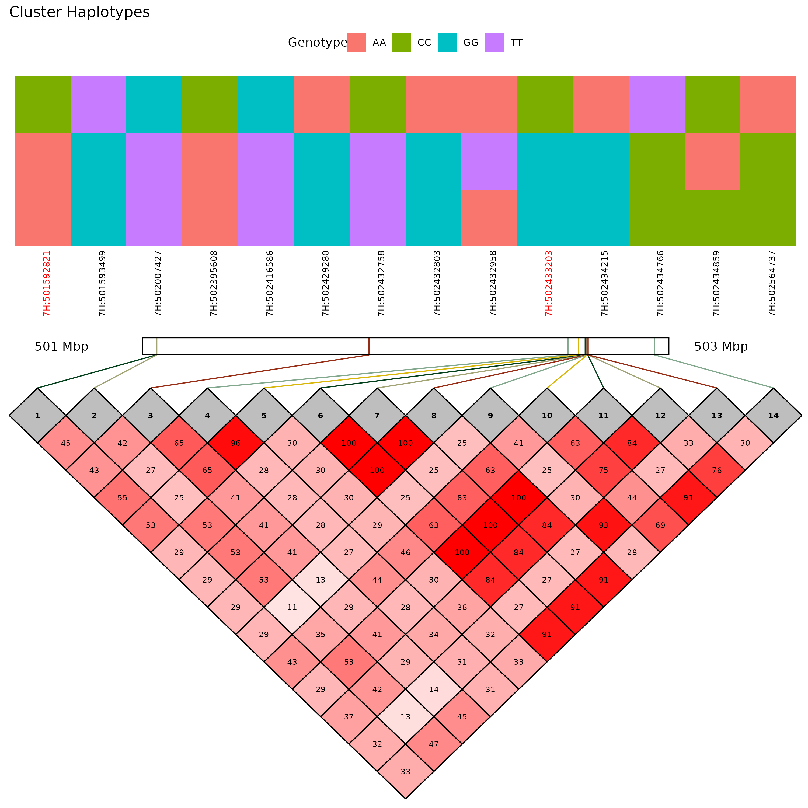

# Haplotype Analysis Project

This project performs haplotype analysis and visualizes phenotypic data across multiple genetic/haplotype combinations to understand the association between haplotypes (SNPs linked by LD) and variation in traits.

## Dependencies

Please install the following R packages before installing the `HaploTraitR` package:

```r
# Install required packages if not already installed
install.packages(c("devtools", "Rcpp", "igraph", "ggplot2", "rstatix", "dplyr", "ggpubr", "reshape2", "gridExtra", "ggtext"))
```

## Installation

```r
# Install the HaploTraitR package from GitHub
devtools::install_github("AlsammanAlsamman/HaploTraitR")
```

## Sample Files

- **Haplotype File:** `Barley_50K_KNNimp.hmp.txt` - Contains SNP genotype information.
- **GWAS File:** `SignificantSNP_GWAS.csv` - Contains significant SNPs identified from a GWAS study.
- **Phenotype File:** `Pheno_ANN19.tsv` - Contains phenotypic data for the traits of interest.

## Test Parameters

- **Distance Threshold:** 1,000,000 (for clustering all SNPs within 1Mb of the significant SNPs)
- **Cluster Count Threshold:** 5 (minimum number of SNPs in a cluster)
- **LD Threshold:** 0.3 (minimum LD value to consider two SNPs in LD)
- **Combination Frequency Threshold:** 0.1 (minimum genotypes with the same combination to consider the combination)

## Configuration Settings

The `HaploTraitR` package allows users to customize various configuration settings. Below are the default settings that can be changed by the user:

- **outfolder:** `NULL` (Output folder for results)
- **dist_threshold:** `1000000` (Distance threshold for clustering SNPs within 1Mb)
- **dist_cluster_count:** `5` (Minimum number of SNPs in a cluster)
- **ld_threshold:** `0.3` (Minimum LD value to consider two SNPs in LD)
- **comb_freq_threshold:** `0.1` (Minimum frequency of genotypes with the same combination)
- **fdr_threshold:** `0.05` (False discovery rate threshold for multiple testing correction)
- **fdr_method:** `"fdr"` (Method for FDR correction)
- **t_test_threshold:** `0.05` (Threshold for t-test significance)
- **t_test_method:** `"t.test"` (Method for t-test)
- **rsid_col:** `"rsid"` (Column name for rsid in GWAS file)
- **pos_col:** `"pos"` (Column name for position in GWAS file)
- **chr_col:** `"chr"` (Column name for chromosome in GWAS file)
- **pval_col:** `"p"` (Column name for p-value in GWAS file)
- **fdr_col:** `"fdr"` (Column name for FDR in GWAS file)
- **phenotypename:** `"Phenotype"` (Name of the phenotype)
- **pheno_col:** `"Phenotype"` (Column name for phenotype in phenotype file)
- **phenotypeunit:** `NULL` (Unit of the phenotype)

To initialize the default configuration, use the `initialize_config` function:

```r
initialize_config()
```

To set or get specific configuration values, use the `set_config` and `get_config` functions:

```r
# Set a configuration value
set_config(config = list(dist_threshold = 500000))

# Get a configuration value
dist_threshold <- get_config("dist_threshold")
print(dist_threshold)
```

## Usage


Sure! Here is the improved and clearer version of the workflow:

### Example Workflow

```r
library(HaploTraitR)

# Step 0: Reset configuration
HaploTraitR::reset_config()

# Step 0.1: List available configuration parameters
# list_config()

# Step 0.2: Set the phenotype information
phenotype <- "Area"
phenotype_unit <- "cm2"
set_config(config = list(phenotypename = phenotype,
                         pheno_col = phenotype,
                         phenotypeunit = phenotype_unit))

# Step 1: Create a unique output folder for results
result_folder <- create_unique_result_folder(location = "sampleout")
set_config(config = list(outfolder = result_folder))

# Step 2: Read Data Files from the Sample Data
gwas_file <- "sampledata/gwas_area_ann19.csv"
hapmap_file <- "sampledata/Barley_50K.tsv"
pheno_file <- "sampledata/area_ann19.tsv"

# Read GWAS data
gwas <- read_gwas_file(gwas_file, sep = ",")
# Read hapmap data
hapmap <- readHapmap(hapmap_file)
# Read phenotype data
pheno <- read.csv(pheno_file, sep = "\t", header = TRUE)

# Or you can use the data provided in the package
# data("barley_area", package = "HaploTraitR")
# gwas <- barley_area$gwas
# hapmap <- barley_area$hapmap
# pheno <- barley_area$pheno

# Step 3: Set FDR threshold and filter GWAS data
set_config(config = list(fdr_threshold = 0.1))
gwas_filtered <- filter_gwas_data(gwas)
print(names(gwas_filtered))
print(gwas_filtered)

# Step 4: Generate Boxplots for Genotype-Phenotype Distribution
bxplts <- boxplot_genotype_phenotype(pheno, gwas_filtered, hapmap)

# Step 5: Cluster SNPs by Chromosome
dist_clusters <- getDistClusters(gwas_filtered, hapmap)

# Step 6: Compute LD Matrices
LDsInfo <- computeLDclusters(hapmap, dist_clusters)

# Step 7: Cluster LD Values and Convert to Haplotypes
clusterLDs <- getLDclusters(LDsInfo)
haplotypes <- HaploTraitR::convertLDclusters2Haps(hapmap, clusterLDs)

# Step 8: Get Sample Haplotypes and Save
snpcomb_sample <- HaploTraitR::getHapCombSamples(haplotypes, hapmap)

# Step 9: Generate SNP Combination Tables
SNPcombTables <- getSNPcombTables(snpcomb_sample, pheno)

# Step 10: Perform t-tests on SNP Combinations
t_test_snpComp <- HaploTraitR::testSNPcombs(SNPcombTables)

# Step 11: Generate and Save Haplotype Combination Boxplots
generateHapCombBoxPlots(SNPcombTables, t_test_snpComp)

# Step 12: Plot Haplotype Distribution (Optional)
# lDplots <- plotLDForClusters(clusterLDs)

# Step 13: Plot LD Combination Matrix with LD
LDCombs <- plotLDCombMatrix(clusterLDs, haplotypes, gwas_filtered)
# Note: For a large number of SNPs, the plot may not be clear or may raise an error.

# Step 14: Plot Haplotypes on the Genome
plot_haplotypes_genome(gwas, haplotypes)
```


## Example Output

Here are some example plots generated using the `HaploTraitR` package:

### Haplotype Combination Boxplot


### LD Combination Matrix


## Team Members

### Dr. Zakaria Kehel
- Affiliation: genetic resources scientist and senior biometrician 
- 

### Dr. Andrea Visioni
- Affiliation: ICARDA Senior scientist
- 

### Dr. Alsamman Alsamman
- Affiliation: ICARDA Bioinformatics consultant
- 

### Dr. Outmane Bouhlal
- Affiliation: ICARDA Senior scientist
- 

### Mr. Khaled Helmy
- Affiliation: ICARDA PhD student
- 

### Ms. Tamara Ortiz
- Affiliation: ICARDA Bioinformatics consultant
- 

### Mr. Doaa Korkar
- Affiliation: ICARDA PhD student
- 
